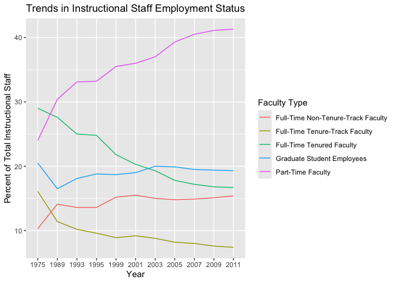

Lab 06 - Ugly charts and Simpson’s paradox
================
Lily Botha
02/23/2026

### Load packages and data

``` r
library(tidyverse) 
library(dsbox)
library(mosaicData) 
```

``` r
staff <- read_csv("data/instructional-staff.csv")
```

### Exercise 1

``` r
staff_long <- staff %>%
  pivot_longer(cols = -faculty_type, names_to = "year") %>%
  mutate(value = as.numeric(value))
staff_long
```

    ## # A tibble: 55 × 3
    ##    faculty_type              year  value
    ##    <chr>                     <chr> <dbl>
    ##  1 Full-Time Tenured Faculty 1975   29  
    ##  2 Full-Time Tenured Faculty 1989   27.6
    ##  3 Full-Time Tenured Faculty 1993   25  
    ##  4 Full-Time Tenured Faculty 1995   24.8
    ##  5 Full-Time Tenured Faculty 1999   21.8
    ##  6 Full-Time Tenured Faculty 2001   20.3
    ##  7 Full-Time Tenured Faculty 2003   19.3
    ##  8 Full-Time Tenured Faculty 2005   17.8
    ##  9 Full-Time Tenured Faculty 2007   17.2
    ## 10 Full-Time Tenured Faculty 2009   16.8
    ## # ℹ 45 more rows

``` r
staff_long %>%
  ggplot(aes(
    x = year,
    y = value,
    group = faculty_type,
    color = faculty_type
  )) +
  labs(
    title = "Trends in Instructional Staff Employment Status",
    x = "Year",
    y = "Percent of Total Instructional Staff",
    color = "Faculty Type"
  ) +
  geom_line()
```

<!-- -->

### Exercise 2

One way to show that the proportion of part-time faculty have gone up
over time compared to other staff types would be to combine the other
staff types into a whole “other” category, or by full-time and grad
students.

### Exercise 3
