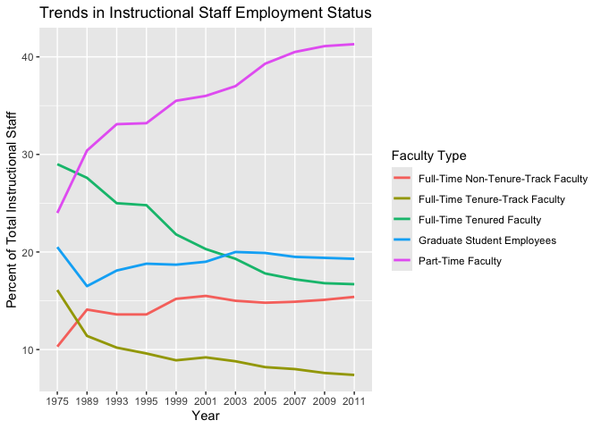
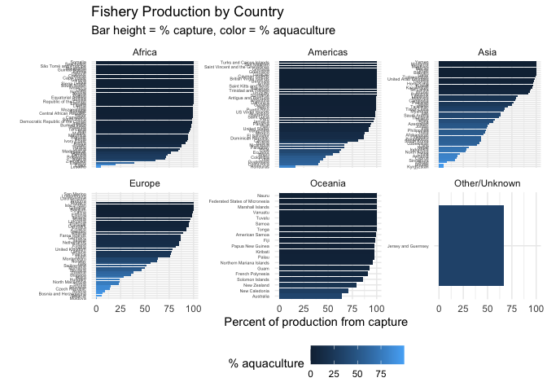

Lab 06 - Ugly charts and Simpson’s paradox
================
Lily Botha
02/23/2026

### Load packages and data

``` r
library(tidyverse) 
library(dsbox)
library(mosaicData) 
library(dplyr)
library(ggplot2)
library(countrycode)
```

### Exercise 1

``` r
staff <- read_csv("data/instructional-staff.csv")
```

``` r
staff_long <- staff %>%
  pivot_longer(cols = -faculty_type, names_to = "year") %>%
  mutate(value = as.numeric(value))
staff_long
```

    ## # A tibble: 55 × 3
    ##    faculty_type              year  value
    ##    <chr>                     <chr> <dbl>
    ##  1 Full-Time Tenured Faculty 1975   29  
    ##  2 Full-Time Tenured Faculty 1989   27.6
    ##  3 Full-Time Tenured Faculty 1993   25  
    ##  4 Full-Time Tenured Faculty 1995   24.8
    ##  5 Full-Time Tenured Faculty 1999   21.8
    ##  6 Full-Time Tenured Faculty 2001   20.3
    ##  7 Full-Time Tenured Faculty 2003   19.3
    ##  8 Full-Time Tenured Faculty 2005   17.8
    ##  9 Full-Time Tenured Faculty 2007   17.2
    ## 10 Full-Time Tenured Faculty 2009   16.8
    ## # ℹ 45 more rows

I improved this graph by using a clean line plot with clear labels, a
descriptive title, and a legend.

``` r
staff_long %>%
  ggplot(aes(
    x = year,
    y = value,
    group = faculty_type,
    color = faculty_type
  )) +
  labs(
    title = "Trends in Instructional Staff Employment Status",
    x = "Year",
    y = "Percent of Total Instructional Staff",
    color = "Faculty Type"
  ) +
  geom_line(linewidth = 1)
```

<!-- -->

### Exercise 2

You could make part-time the focus by making it one bold color, and
making the other lines grey. Or, you could directly label the part-time
trend line.

### Exercise 3

``` r
fisheries <- read_csv("data/fisheries.csv")
```

    ## Rows: 216 Columns: 4
    ## ── Column specification ────────────────────────────────────────────────────────
    ## Delimiter: ","
    ## chr (1): country
    ## dbl (3): capture, aquaculture, total
    ## 
    ## ℹ Use `spec()` to retrieve the full column specification for this data.
    ## ℹ Specify the column types or set `show_col_types = FALSE` to quiet this message.

Issues: The pie charts are very unhelpful. There are way too many
slices, so its impossible to make any meaningful comparisons. The chart
on the left is also confusing. You can’t see all the countries on the
x-axis, there’s no clear grouping, and it doesn’t really match with the
pie charts. There is no clear takeaway from these plots.

Improvements: I want to get rid of the pie charts and instead use sorted
bar charts that are grouped. Instead of using tons, I want to convert to
percent of production for easier comparisons. The countries could be
sorted by capture percentage, and the plots should be faceted by
continent to reduce clutter. I can show the aquaculture percentage by
using color fill, and I will also add better labels/themes.

Aspirational improvements: Maybe it would be helpful to show only the
top producing countries per continent. There are still too many
countries per facet, so the plot looks dense.

``` r
fisheries %>%
  group_by(country) %>%
  summarise(
    capture = sum(capture, na.rm = TRUE),
    aquaculture = sum(aquaculture, na.rm = TRUE),
    total = sum(total, na.rm = TRUE),
    .groups = "drop"
  ) %>%
  mutate(
    percentcapture = 100 * capture / total,
    percentaquaculture = 100 * aquaculture / total,
    continent = suppressWarnings(countrycode(country,
      origin = "country.name",
      destination = "continent"
    )),
    continent = if_else(is.na(continent), "Other/Unknown", continent),
    continent = factor(continent),
    country = reorder(country, percentcapture)
  ) %>%
  ggplot(aes(x = country, y = percentcapture, fill = percentaquaculture)) +
  geom_col() +
  coord_flip() +
  facet_wrap(~ continent, scales = "free_y") +
  labs(
    x = "",
    y = "Percent of production from capture",
    title = "Fishery Production by Country",
    subtitle = "Bar height = % capture, color = % aquaculture",
    fill = "% aquaculture"
  ) +
  theme_minimal() +
  theme(
    legend.position = "bottom",
    axis.text.y = element_text(size = 4)
  )
```

    ## Warning: Removed 4 rows containing missing values or values outside the scale range
    ## (`geom_col()`).

<!-- -->

### Exercise 4 (stretch goal - come back later!)
